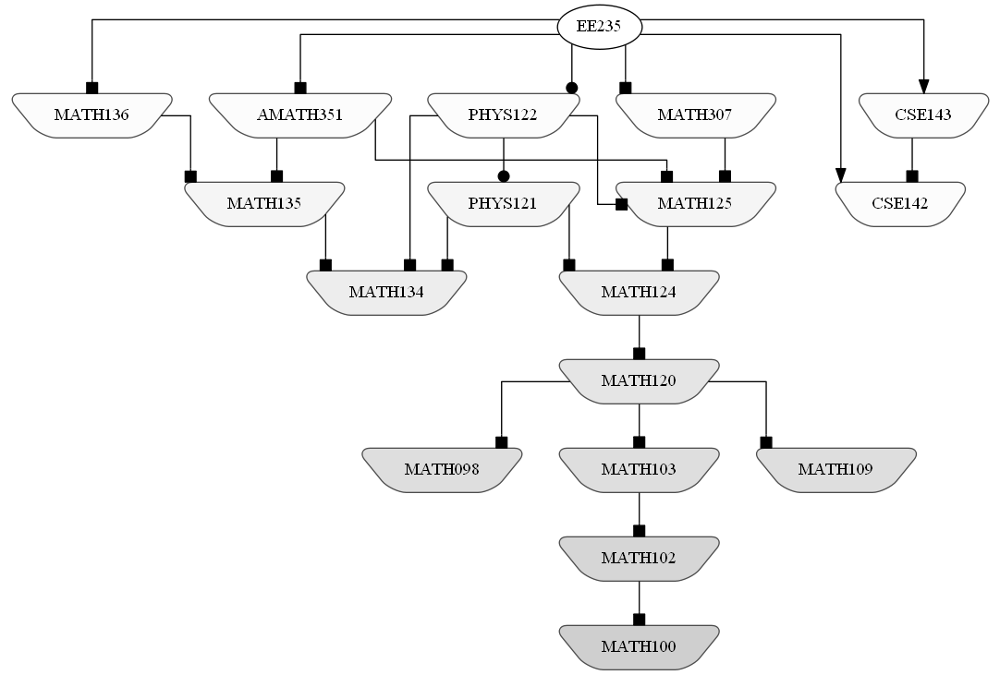
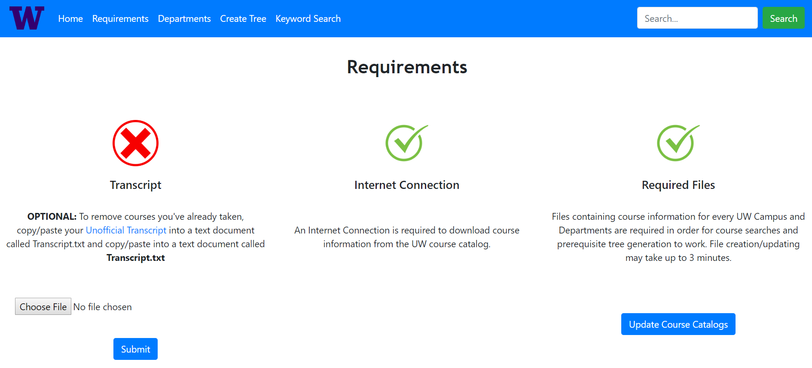
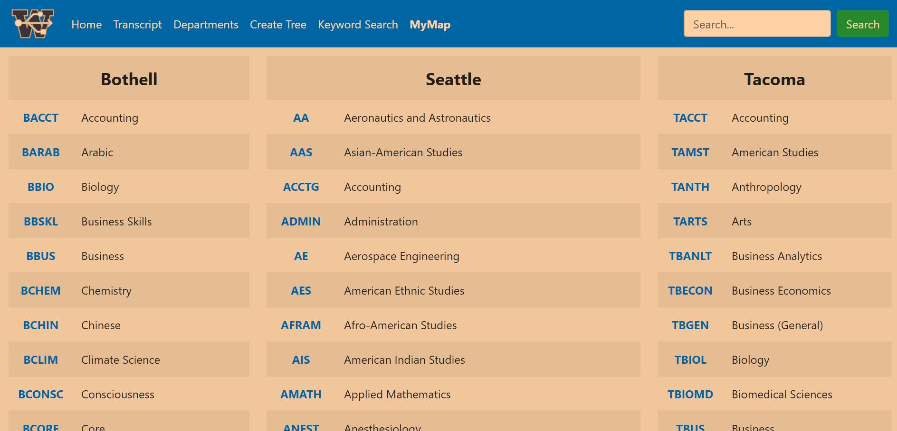
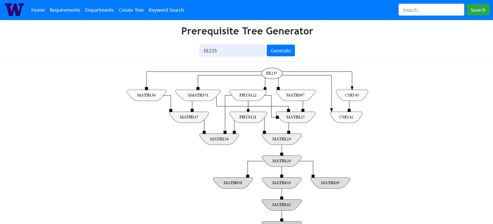
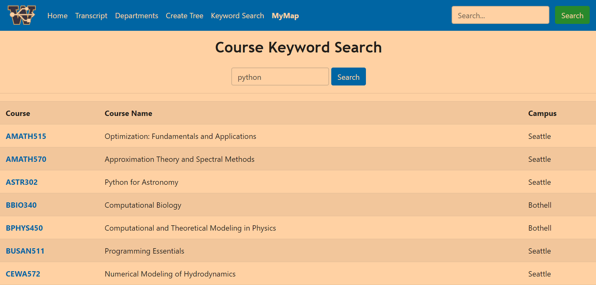

# UW Course Tool

 Search for any course offered at any one of the three UW Campuses and see a full tree of prerequisites for that course. There is also an option to scan in your transcript as a `.txt` file to eliminate any course in the tree that has already been taken. 
 Run `main.py` for a console interface and `app.py` to run the website on the localhost.

***

**Always make sure to check the actual prerequisites for any course before making a decision on which course to take!**

***

### Scraping

The UW Course Tool offers web scraping for the [UW Time Schedule](https://www.washington.edu/students/timeschd/) and for UW Course Catalogs (see below) for every UW Campus. This data is stored in `.json` files that can be found in the `UW_Course_Catalogs` and `UW_Time_Schedules` directories. 

#### UW Course Catalogs
 >[Bothell](http://www.washington.edu/students/crscatb/)                             
 [Seattle](http://www.washington.edu/students/crscat/)                                
 [Tacoma](http://www.washington.edu/students/crscatt/) 

#### UW Time Schedules
 >[Bothell](https://www.uwb.edu/registration/time)                             
 [Seattle](https://www.washington.edu/students/timeschd/)                                
 [Tacoma](https://www.washington.edu/students/timeschd/T/)

### Prerequisite Tree
A prerequisite tree for any course offered at the UW can be created as a PNG file or in the console (see below).
The prerequisite tree for **EE235** as a PNG is shown below.

All courses at the same 'level' in the tree are the same color. Courses with the same shape at the end of the arrow
indicate that **ONE** of those courses is enough to statisfy the prerequisite requirement. 



### Console Display
The following prerequisite tree for **EE235** is shown below.
Courses connected with a | and that have a * next to them indicates that any one of those courses will fulfill the prerequisite requirement for the course. This can be seen below with **MATH136, MATH307, AMATH351** which each have a * next to them and are all at the same 'level' in the prerequisite tree. The same can be seen for **MATH120**, as **MATH098, MATH103, or MATH109** will suffice to fulfill the prerequisite requirement for that course. 

```
MATH136*
|   MATH135
|   |   MATH134
MATH307*
|   MATH125
|   |   MATH124
|   |   |   MATH120
|   |   |   |   MATH098*
|   |   |   |   MATH103*
|   |   |   |   |   MATH102
|   |   |   |   |   |   MATH100
|   |   |   |   MATH109*
AMATH351*
|   MATH125*
|   |   MATH124
|   |   |   MATH120
|   |   |   |   MATH098*
|   |   |   |   MATH103*
|   |   |   |   |   MATH102
|   |   |   |   |   |   MATH100
|   |   |   |   MATH109*
|   MATH135*
|   |   MATH134
```
There is a space between the **MATH136, MATH307, AMATH351** branch and the **PHYS122** branch. This indicated that in order to take **EE235**, the student must take one of **MATH136, MATH307, or AMATH351** AND **PHYS122**. 
```
PHYS122
|   MATH125*
|   |   MATH124
|   |   |   MATH120
|   |   |   |   MATH098*
|   |   |   |   MATH103*
|   |   |   |   |   MATH102
|   |   |   |   |   |   MATH100
|   |   |   |   MATH109*
|   MATH134*

|   PHYS121
|   |   MATH124*
|   |   |   MATH120
|   |   |   |   MATH098*
|   |   |   |   MATH103*
|   |   |   |   |   MATH102
|   |   |   |   |   |   MATH100
|   |   |   |   MATH109*
|   |   MATH134*
```
Below the **PHYS122** branch **CSE142** and **CSE143** are both shown with a * next to them, indicating that either one of these courses along with one of **MATH136, MATH307, or AMATH351** AND **PHYS122** will fulfill the prerequisite requirement.
```
CSE142*
CSE143*
|   CSE142
```

### Flask Application

There is an option to run this application on a server and to generate prerequisite trees on the web.
In order to run the `Flask` application on the localhost open the Command Line and `cd` into the directory where the application is stored. Once there input the following command:

```
python app.py
```

Then open the following link to access the website: http://127.0.0.1:5000/home/

The following page should appear:


The other pages on the site:



***



***



***



***

### Course Data

Course Data | Description 
:--- | ---
**Campus** | The campus the course is offered at.
**Department Name** | The name of the department the course is a part of. Denoted by a series of capital letters with no spaces.
**Course Number** | The 3 digit number identifying the course.
**Course Name** | The name of the course.
**Credits** | The number of credits offered for the course. Some courses have variable credits offered/different credit options. Check out the UW's guide for the credit system [here](http://www.washington.edu/students/crscat/glossary.html).
**Areas of Knowledge** | Areas of Knowledge essentially are credit types. [More Information](https://www.washington.edu/uaa/advising/degree-overview/general-education/).
**Quarters Offered** | The quarters of the year the course is offered. **A**utumn, **W**inter, **Sp**ring, **S**ummer.
**Offered with** | At times, a course may be offered alongside a similar course in a different department. 
**Prerequisites** | Courses that must be taken in order to take the course. 
**Co-Requisites** | Courses that must be taken at the same time the desired course is being taken.
**Description** | The description of the course objectives.

***

### File Creation
The prerequisite trees rely on data from `.tsv` files in order to work. `.json` files with course data for each
UW Campus are also created as well as a `Total.tsv` and `Total.json` file with course data for all campuses. 

The `.tsv` and `.json` files are included in the `UW_Campus_Catalogs` folder.

<p align = "center">

**TSV** | **JSON**
:---: | :---:
[Bothell](UW_Campus_Catalogs/TSV/Bothell.tsv) | [Bothell](UW_Campus_Catalogs/JSON/Bothell.json)
[Seattle](UW_Campus_Catalogs/TSV/Seattle.tsv) | [Seattle](UW_Campus_Catalogs/JSON/Seattle.json)
[Tacoma](UW_Campus_Catalogs/TSV/Tacoma.tsv) | [Tacoma](UW_Campus_Catalogs/JSON/Tacoma.json)
[Total](UW_Campus_Catalogs/TSV/Total.tsv) | [Total](UW_Campus_Catalogs/JSON/Total.json)

</p>

Upon starting `main.py`, if the `UW_Campus_Catalogs` directory is not present in the directory 
of the scripts, it will automatically be created and filled with the documents in the table above.
If the `UW_Campus_Catalogs` directory is present, there will be a prompt asking if the course catalogs
should be updated:

```python
Course catalogs were last updated on XXXX-XX-XX XX:XX:XX
Would you like to update the Course Catalogs? (y/n):
```

### Requirements/Dependencies

Python 3.7

#### Web Scraping and Tree Generation using GraphViz

```
 - tqdm         [pip install tqdm]
 - bs4          [pip install beautifulsoup4]
 - Graphviz     [pip install graphviz]
 - Requests     [pip install requests]
```

#### Flask Application
```
 - Flask        [pip install flask]
 ```

The directory for the application is structured according to the diagram below:
```
static
    Images
        Images used for website
    Prerequisite_Trees
        All generated Prerequisite Trees
templates
    All HTML files
UW_Campus_Catalogs
    TSV
        All .tsv files for each campus
    JSON
        All .json files for each campus and all departments
```

***

In order for the visual representation with Graphviz to work, [Graphviz](https://graphviz.gitlab.io/download/) must be downloaded. Once downloaded go to `create_tree.py`. and change the System Path under `GRAPHVIZ PATH SETUP`
Make sure to add the `bin` folder of the downloaded Graphviz folder to the end of the system path.

```python
# --------------------------GRAPHVIZ PATH SETUP-------------------------- #
os.environ["PATH"] += os.pathsep + [FILE PATH TO GRAPHVIZ bin FOLDER] 
# ----------------------------------------------------------------------- #
```

#### 'Graphviz Executables not on system Path' Error
If this error comes up try:
```
pip install graphviz
```
followed by:
```
conda install graphviz
```

If the error persists:

##### MAC
```
brew install graphviz
```
##### Ubuntu
```
sudo apt-get install graphviz
```
