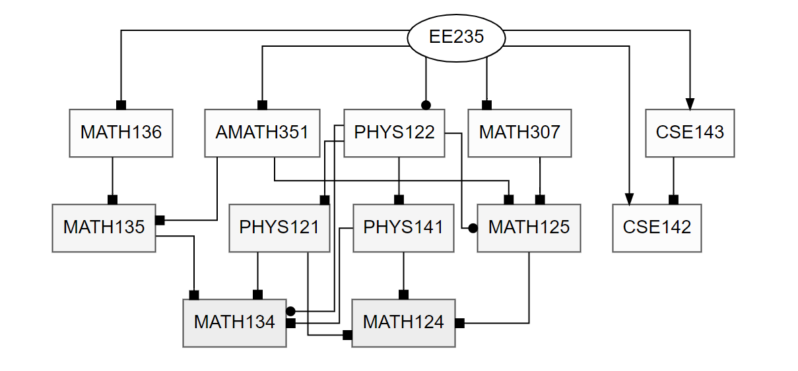

# UW Course Planner

Web App with schedule visualization, recursive prerequisite tree generation and keyword search for courses offered at the University of Washington (UW).

Check out http://alexeidt.pythonanywhere.com/ for a live demo!

***

**Always make sure to check the actual prerequisites for any course before making a decision on which course to take!**

***

### Scripts

Script | Purpose
--- | ---
`app.py` | Runs the Flask Application on the localhost. Alternatively go to [alexeidt.pythonanywhere.com](http://alexeidt.pythonanywhere.com/) to see the same site.
`create_tree.py` | Creates Prerequisite Trees. Not runnable by itself.
`schedule.py` | Creates an Organized Time Schedule for the courses offered for the current quarter at UW.

#### UW Course Catalogs

 >[Bothell](http://www.washington.edu/students/crscatb/)                             
 [Seattle](http://www.washington.edu/students/crscat/)                                
 [Tacoma](http://www.washington.edu/students/crscatt/) 

#### UW Time Schedules

 >[Bothell](https://www.uwb.edu/registration/time)                             
 [Seattle](https://www.washington.edu/students/timeschd/)                                
 [Tacoma](https://www.washington.edu/students/timeschd/T/)

### Prerequisite Tree

A prerequisite tree for any course offered at the UW can be created as a PNG file or in the console (see below).
The prerequisite tree for **EE235** as a PNG is shown below.

All courses at the same 'level' in the tree are the same color. Courses with the same shape at the end of the arrow
indicate that **ONE** of those courses is enough to statisfy the prerequisite requirement. 



### Department Tree

A graph showing the prerequisite connections of all courses in the same department gives a good overview of the department as a whole.


### MyMap

The UW Course Tool can show you all combinations of course sections at UW that do not overlap. All three UW Campuses are included. 


### Flask Application

There is an option to run this application on a server and to generate prerequisite trees on the web.
In order to run the `Flask` application on the localhost open the Command Line and `cd` into the directory where the application is stored. Once there input the following command:

```
python app.py
```

Then open the following link to access the website: http://127.0.0.1:5000/

Alternatively, go to the live demo at: [alexeidt.pythonanywhere.com](http://alexeidt.pythonanywhere.com/)

### Requirements/Dependencies

`Python 3.6+`

Install Requirements with

```
pip install -r requirements.txt
```

The directory for the application is structured according to the diagram below:
```
static
    Images
        Images used for website
    Prerequisite_Trees
        All generated Prerequisite Trees
    JavaScript
        All JavaScript files for each HTML file in 'templates'
    UW_Time_Schedules
        Organized_Time_Schedules
            All offered courses with quiz/lab/studio sections assigned to their respective lecture
        All Time Schedules for each UW Campus
templates
    All HTML files
```

***

In order for the visual representation with Graphviz to work, [Graphviz](https://graphviz.gitlab.io/download/) must be downloaded. Once downloaded go to `create_tree.py`. and change the System Path under `GRAPHVIZ PATH SETUP`
Make sure to add the `bin` folder of the downloaded Graphviz folder to the end of the system path.

```python
# --------------------------GRAPHVIZ PATH SETUP-------------------------- #
os.environ["PATH"] += os.pathsep + [FILE PATH TO GRAPHVIZ bin FOLDER] 
# ----------------------------------------------------------------------- #
```

#### 'Graphviz Executables not on system Path' Error
If this error comes up try:
```
pip install graphviz
```
followed by:
```
conda install graphviz
```

If the error persists:

##### MAC
```
brew install graphviz
```
##### Ubuntu
```
sudo apt-get install graphviz
```
